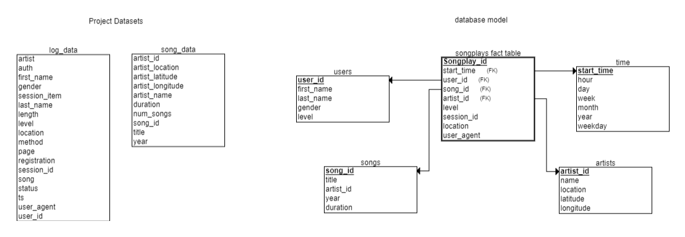

# Creating a Datalake with Spark
***
## Udacity Data Engineer Nano Degree Project 4
***
### Introduction
This project consists of executing an ETL process, extracting the data from an S3 bucket, performing the transformation using Apache Spark and loading the data back to an S3 datalake in parquet format.

### The goal
***
The goal is to extract data from S3, process the data whit Apache Spark, load the data via s3 and implement the ETL pipeline for this project.

### Database Schema
***


### Project Files
***
```data``` : Stores example data. <br>
```sparkify_erd_project``` : The database model. <br>
```dl.cfg``` : A cfg archive example. <br>
```etl.py``` : Call extract, transform and load process. <br>
```README.md``` : a project discussion.
